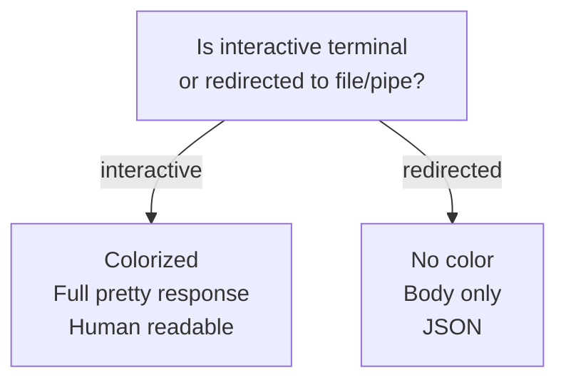

# Guide

This guide will help you to get started installing and using Restish.

## Installation

You can install in one of three ways: Homebrew tap, GitHub release, or via `go get`.

If you have [Homebrew](https://brew.sh/) then install via the official tap:

```bash
# Install directly through the Homebrew tap
$ brew install danielgtaylor/restish/restish
```

If you don't have Homebrew, you can grab a [release](https://github.com/danielgtaylor/restish/releases) for your platform and manually copy the executable to the right location (e.g. `/usr/local/bin/restish`), otherwise if you have Go installed:

```bash
# Download / build / install
$ go install github.com/danielgtaylor/restish@latest
```

You can confirm the installation worked by trying to run Restish:

```bash
# Basic test to confirm everything is installed
$ restish --version
```

?> If using `zsh` as your shell (the default on macOS), you should set `alias restish="noglob restish"` in your `~/.zshrc` to prevent it from trying to handle `?` in URLs and `[]` in shorthand input. Alternatively you can use quotes around your inputs.

## Basic Usage

Generic HTTP verbs require no setup and are easy to use. If no verb is supplied then a GET is assumed. The `https://` is also optional as it is the default.

```bash
# Perform an HTTP GET request
$ restish api.rest.sh/types

# Above is equivalent to:
$ restish get https://api.rest.sh/types
```

You will see a response like:

```readable
HTTP/2.0 200 OK
Content-Length: 278
Content-Type: application/cbor
Date: Tue, 19 Apr 2022 21:17:58 GMT

{
  $schema: "https://api.rest.sh/schemas/TypesModel.json"
  boolean: true
  integer: 42
  nullable: null
  number: 123.45
  object: {
    binary: 0xdeadc0de
    binary_long: 0x00010203040506070809...
    date: 2022-04-23
    date_time: 2022-04-23T21:41:58.20449651Z
    url: "https://rest.sh/"
  }
  string: "Hello, world!"
  tags: ["example", "short"]
}
```

For a bigger real-world example check out:

```bash
$ restish api.rest.sh/example
```

!> Note that the output above is **not** JSON! By default, Restish outputs an HTTP+JSON-like format meant to be more readable. See [output](/output.md) for more info.

### Input Parameters & Body

Various inputs can be passed in as needed:

```bash
# Pass a query param (either way)
$ restish api.rest.sh/?active=true
$ restish -q active=true api.rest.sh

# Pass a header
$ restish -H Accept:application/json api.rest.sh

# Pass in a body via a file
$ restish post api.rest.sh <input.json

# Pass in body via CLI shorthand
$ restish post api.rest.sh name: Kari, tags[]: admin
```

Read more about [CLI Shorthand](/shorthand.md). Headers and query params can also be set via environment variables by prefixing with `RSH_`, for example:

```bash
# Set via env vars
$ export RSH_HEADER=header1:value1,header2:value2
$ restish api.rest.sh
```

?> If you have persistent headers or query params you'd like to set, then consider registering the API endpoint with Restish rather than exporting environment variables. Read on to find out how.

### Editing Resources

If an API supports both a `GET` and a `PUT` for a resource, there is a client-side `edit` convenience operation which allows you to edit the resource similar to how you might use a `PATCH` if the API were available.

```bash
# Modify a field on the command line via CLI shorthand
$ restish edit api.rest.sh/types string: changed, tags[]: another

# Modify a resource interactively in your editor
$ restish edit -i api.rest.sh/types
```

To use interactive mode you must have the `VISUAL` or `EDITOR` environment variable set to an editor, for example `export VISUAL="code --wait"` for VSCode. If the API resource includes a `$schema` then you will also get documentation on hover, completion suggestions, and linting as you type in your editor.

Editing resources will make use of [conditional requests](https://developer.mozilla.org/en-US/docs/Web/HTTP/Conditional_requests) if any relevant headers are found on the `GET` response. For example, if an `ETag` header is present in the `GET` response then an `If-Match` header will be send on the `PUT` to prevent performing the write operation if the resource was modified by someone else while you are editing.

### Output Filtering

Restish includes built-in filtering using [Shorthand queries](shorthand.md#querying) which enable you to filter & project the response data. Using a filter only prints the result of the filter expression. Here are some basic examples:

```bash
# Get social media profiles from a JSON Resume:
$ restish api.rest.sh/example -f body.basics.profiles
[
  {
    "network": "Github",
    "url": "https://github.com/danielgtaylor"
  },
  {
    "network": "Dev Blog",
    "url": "https://dev.to/danielgtaylor"
  },
  {
    "network": "LinkedIn",
    "url": "https://www.linkedin.com/in/danielgtaylor"
  }
]

# Advanced filtering example:
$ restish api.rest.sh/example -f 'body.volunteer[organization.lower == restish]|[0].{organization, startDate, summary}'
{
  "organization": "Restish",
  "startDate": "2018-09-29T00:00:00Z",
  "summary": "A CLI for interacting with REST-ish HTTP APIs with OpenAPI 3 support built-in."
}

# Access headers & use raw mode to remove quotes:
$ restish api.rest.sh -f headers.Date -r
Sat, 1 Jan 2022 12:00:00 GMT
```

See [filtering & projection](output.md#filtering--projection) for more info & examples.

### Output Defaults

Like some other well-known tools, the output defaults are different depending on whether the command is running in an interactive shell or output is being redirected to a pipe or file.



See [output defaults](output.md#output-defaults) for more information.

!> Use `restish api content-types` to see the avialable content types and output formats you can use.

### Tabular Output

Sometimes it's easier to read a response when you can see it in the form of a two-dimentional table. Restish supports the `table` output format for this purpose if the response (or filtered result) is an array of objects. For example:

```bash
$ restish api.rest.sh/images -o table
HTTP/2.0 200 OK
Accept-Ranges: bytes
...

╔════════╤════════════════════════════╤══════════════╗
║ format │            name            │     self     ║
╟━━━━━━━━┼━━━━━━━━━━━━━━━━━━━━━━━━━━━━┼━━━━━━━━━━━━━━╢
║   jpeg │            Dragonfly macro │ /images/jpeg ║
║   webp │   Origami under blacklight │ /images/webp ║
║    gif │ Andy Warhol mural in Miami │  /images/gif ║
║    png │          Station in Prague │  /images/png ║
║   heic │     Chihuly glass in boats │ /images/heic ║
╚════════╧════════════════════════════╧══════════════╝
```

## API Operation Commands

APIs can be registered in order to provide API description auto-discovery (e.g. OpenAPI 3) with convenience commands and authentication. The following API description formats and versions are supported:

| Format  | Version | Notes              |
| ------- | ------- | ------------------ |
| Swagger | 2.0     | ❌ Not supported   |
| OpenAPI | 3.0     | ✅ Fully supported |
| OpenAPI | 3.1     | ✅ Fully supported |

APIs are registered with a short nickname. For example the GitHub v3 API might be called `github` or the Digital Ocean API might be called `do`.

Each registered API can have a number of named profiles which can be selected via the `-p` or `--rsh-profile` argument. The default profile is called `default`.

Each profile can have a number of preset headers or query params, a type of auth, and any auth-specific params.

Getting started registering an API is easy and uses an interactive prompt to set up profiles, auth, etc. At a minimum you must provide a short nickname and a base URL:

```bash
# How to register a new API
$ restish api configure $SHORT_NAME $URL

# Register a new API called `example`
$ restish api configure example https://api.rest.sh
```

What exactly does this do? It sets up the API short name `example` to point to `https://api.rest.sh` in a configuration file (usually `~/.restish/apis.json`) and finds [https://api.rest.sh/openapi.json](https://api.rest.sh/openapi.json) in order to discover available API operations, documentation, parameters, schemas, etc. You can see the available operations via:

```bash
# If an OpenAPI or other API description document was found, this will show
# you all available commands.
$ restish example --help
```

Let's try calling the API:

```bash
# Call an API operation
$ restish example list-images
HTTP/2.0 200 OK
Content-Length: 291
Content-Type: application/cbor
Date: Sun, 24 Apr 2022 15:21:26 GMT
Link: </schemas/ImageItemList.json>; rel="describedby"

[
  {
    format: "jpeg"
    name: "Dragonfly macro"
    self: "/images/jpeg"
  }
  {
    format: "webp"
    name: "Origami under blacklight"
    self: "/images/webp"
  }
  {
    format: "gif"
    name: "Andy Warhol mural in Miami"
    self: "/images/gif"
  }
  {
    format: "png"
    name: "Station in Prague"
    self: "/images/webp"
  }
  {
    format: "heic"
    name: "Chihuly glass in boats"
    self: "/images/heic"
  }
]
```

```bash
# Call the same operation, re-using the same headers & auth
$ restish api.rest.sh/images
```

If you had configured multiple profiles, then something like this would work:

```bash
# Make a request with a non-default profile
$ restish -p my-profile example list-images
```

You can even use the short nickname in place of the full API domain, so for example this works (`example` expands to `https://rest.sh`):

```bash
# Use the API nickname instead of the domain
$ restish example/images
```

Calling operations with required parameters is easy too as they just become arguments:

```bash
# Call with the required image type path parameter
$ restish example get-image jpeg
```

For more details, check out [OpenAPI](openapi.md).

### Shell Command Line Completion

Restish has support for dynamic shell completion built-in. See the help for your shell for how to enable this:

```bash
$ restish completion bash --help
$ restish completion zsh --help
$ restish completion powershell --help
```

If using Homebrew, you may need one additional step to [include the Homebrew completions path](https://docs.brew.sh/Shell-Completion) for your shell.

Once set up, you can use the `tab` key to discover API commands. For example:

```bash
# Tab completion example
$ restish <tab>
example

# Tab completion of partial commands
$ restish example get-<tab>
get-cached         -- Cached response example
get-echo           -- Echo GET
get-example        -- Example large structured data response
get-image          -- Get an image
...

# Tab completion of partial URLs
$ restish example/images
example/images         -- Paginated list of all images
example/images/{type}  -- Get an image
```

That's it for the guide! Hopefully this gave you a quick overview of what is possible with Restish. See the more in-depth topics in the side navigation bar to go deep on how all the above works and is used. Thanks for reading! :tada:
