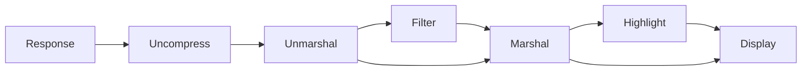
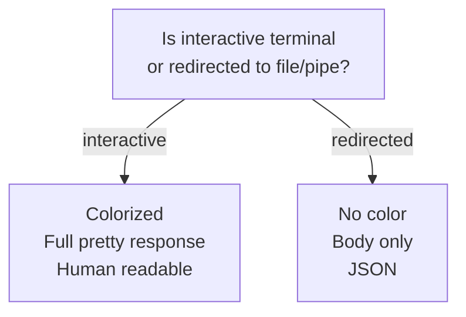

# Controlling Output

Responses are processed like the below directed graph shows. For example, a server might send a response that Restish will gzip uncompress, unmarshal from CBOR, apply a filter, marshal the result into JSON & highlight to display.



## Caching

By default, Restish will cache responses with appropriate [RFC 7234](https://tools.ietf.org/html/rfc7234) caching headers set. When fetching API service descriptions, a 24-hour cache is used if _no cache headers_ are sent by the API. This is to prevent hammering the API each time the CLI is run. The cached responses are stored in one of the following operating-system dependent locations:

| OS      | Path                                 |
| ------- | ------------------------------------ |
| Mac     | `~/Library/Caches/restish/responses` |
| Windows | `%LocalAppData%\restish\responses`   |
| Linux   | `~/.cache/restish/responses`         |

The easiest way to tell if a cached response has been used is to look at the `Date` header, which will not change from request to request if a cached response is returned.

You may wish to disable caching to force an updated fetch:

```bash
# Disable local caching via arg
$ restish --rsh-no-cache api.rest.sh/cached/15?private=true

# Disable local caching via env
$ RSH_NO_CACHE=1 restish api.rest.sh/cached/15?private=true
```

Even if caching is disabled, the local disk cache will get updated. The setting above prevents the _use_ of a cached response.

## Readable output

Readable output is a custom format that is similar to JSON or YAML and meant to be easily consumed by humans while supporting both text and binary formats. Here is an example of how various types look:

```readable
HTTP/1.1 200 OK
Cache-Control: max-age=30
Content-Length: 100
Content-Type: application/cbor
Date: Thu, 28 May 2020 05:56:31 GMT

{
  binary: 0x00030402060a632a3016...
  created: 2020-05-27T05:41:19.603396Z
  date: 2020-05-27
  id: "test"
  nested: {
    saved: true
    self: "https://api.rest.sh/example"
  }
  json: {
    datetime: "2020-05-27T05:41:19.603396Z"
    binary: "AAECAwQF"
  }
  pointer: null
  tags: ["one", "tw\"o", "three"]
  value: 123
}
```

Unlike JSON and similar to YAML, object property names have no quotes and there are no commas. This is powered by a custom [marshaller](https://github.com/danielgtaylor/restish/blob/main/cli/readable.go) and [lexer](https://github.com/danielgtaylor/restish/blob/main/cli/lexer.go) to enable syntax highlighting.

The following types are supported & syntax highlighted:

- `null`
- Booleans `true` and `false`
- Numbers including scientific notation
- Strings
  - Special formatting for links
  - Special formatting for dates
- Dates (ISO8601 / RFC3339)
- Binary data as hex, e.g. `0xdeadbeef...`
  - Why hex? It's easier to read for a human than string escape codes or base64.

If the output is _not_ structured data (JSON/YAML/CBOR/etc) then it is output as-is without formatting.

?> Keep in mind the default interactive shell output format is meant for **human** consumption! See [output defaults](#output-defaults) below for how JSON is used by default when redirecting output for scripting.

### Images

Basic image support is available using unicode half-blocks if your terminal supports these unicode characters and true color mode. For example:


Try it out:

```bash
# Display the Restish logo!
$ restish rest.sh/logo.png

# Display another example:
$ restish api.rest.sh/images/gif
```

## Response structure

Internally, the response is structured like this:

```json
{
  "proto": "HTTP/2.0",
  "status": 200,
  "headers": {
    "Content-Type": "application/json"
  },
  "links": {
    "next": [
      {
        "rel": "next",
        "uri": "https://api.rest.sh/images?cursor=abc123"
      }
    ]
  },
  "body": {
    "id": 123,
    "description": "This is the parsed structured data"
  }
}
```

The headers are canonicalized (so `Content-Type` rather than `content-type`), the links are [standardized](hypermedia.md) and resolved, and the body is parsed based on the incoming content type, abstracting away the need to worry about different formats, encodings, etc.

The above is the same structure used when setting the output format to something other than the default, e.g. JSON or YAML:

```bash
# Output a response as JSON
$ restish -o json api.rest.sh/images
```

## Filtering & projection

Restish includes basic response filtering functionality through the [Shorthand Query Syntax](shorthand.md#Querying). It's a language for filtering and projecting the response value that's useful for paring down and massaging the response data for scripts.

The response format described above is used as the input, so don't forget the `body` prefix when accessing body members!

```bash
# Print out request headers
$ restish api.rest.sh/images -f headers

# Filter results to just the names
$ restish api.rest.sh/images -f 'body.{name}'

# Get all `url` fields recursively from a response that are from Github
$ restish api.rest.sh/example -f '..url|[@ contains github]'
```

## Output defaults

Like some other well-known tools, the output defaults are different depending on whether the command is running in an interactive shell or output is being redirected to a pipe or file.



The defaults are described in the following table:

| Feature       | Interactive   | Redirected  | Options                |
| ------------- | ------------- | ----------- | ---------------------- |
| Color         | enabled       | disabled    | `COLOR=1`, `NOCOLOR=1` |
| Filter        | full response | `body` only | `-f`                   |
| Output format | `readable`    | `json`      | `-o`                   |

The following options are functionally equvalent to the defaults:

| Mode        | Equivalent Options                 |
| ----------- | ---------------------------------- |
| Interactive | `COLOR=1` and `-o readable -f '@'` |
| Redirected  | `NOCOLOR=1` and `-o json -f body`  |

Here are some useful examples:

```bash
# Redirect body JSON to a file
$ restish api.rest.sh/types >file.json

# Redirect the entire response (status, headers, body) to a file
$ restish api.rest.sh/types -f '@' >file.json

# Redirect using the interactive terminal defaults
$ COLOR=1 restish api.rest.sh/types -o readable -f '@' | less
```

!> Use `restish api content-types` to see the avialable content types and output formats you can use.

## Raw mode

Raw mode, when enabled, will remove JSON formatting from the filtered output if the result matches one of the following:

- A string
- An array of scalars (null, bool, number, string)

For example:

```bash
# Normal mode
$ restish api.rest.sh/images -f 'body[0].self'
"/images/jpeg"

# Raw mode strips the quotes
$ restish api.rest.sh/images -f 'body[0].self' -r
/images/jpeg

# It also works with arrays
$ restish api.rest.sh/images -f 'body.self' -r
/images/jpeg
/images/webp
/images/gif
/images/webp
/images/heic
```

If the filtered output result doesn't match one of the above types, then `-r` is a no-op.

This feature is mainly useful for shell scripting, where you don't want to have to parse the JSON and instead just want to loop through a list of IDs and run further commands.

## Downloading files & saving responses

Output redirection and/or raw mode can be used to download files & save structured responses in various formats (e.g. JSON, CBOR, YAML, etc):

```bash
# Save a binary file from the server
$ restish rest.sh/logo.png >logo.png

# Save parsed & formatted structured body as JSON
$ restish api.rest.sh/types >types.json

# Save parsed & formatted structured body as CBOR
$ restish api.rest.sh/types -o cbor >types.cbor

# Save unparsed structured body via raw mode
$ restish api.rest.sh/types -H Accept:application/json -r >types.json
```

?> Raw mode without filtering will not parse the response, but _will_ decode it if compressed (e.g. with gzip or brotli).

## Exit status codes

Restish will exit with the following status codes by default in order to facilitate scripting. The most recent HTTP status code is used when a command makes more than one request.

| Code | Description          |
| ---- | -------------------- |
| 0    | Success              |
| 1    | Unrecoverable errors |
| 2    | -                    |
| 3    | 3xx HTTP response    |
| 4    | 4xx HTTP response    |
| 5    | 5xx HTTP response    |

Use the `--rsh-ignore-status-code` option or `RSH_IGNORE_STATUS_CODE=1` environment variable to ignore the exit status code and always return 0 for 3xx/4xx/5xx responses.
